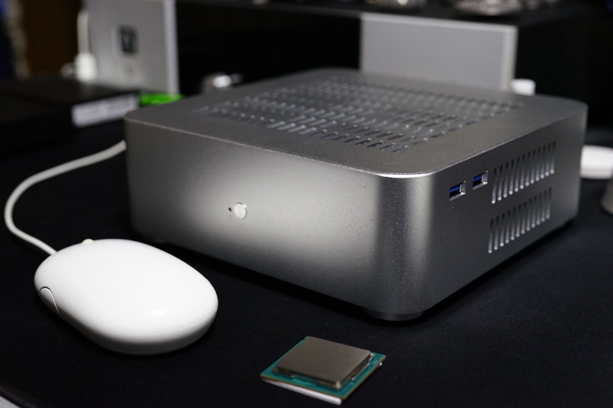

## Hackintosh Build: Macmini 2018

|hardware|spec|
|-|-|
|系统| MacOS 10.14.4 |
|处理器| Intel Core i3-8100 @ 3.6GHz |
|主板| Onda H310SD3-ITX |
|内存| Onda 8*2G DDR3-1600 |
|硬盘| Intel 540s 360G M.2 |
|显卡| Intel UHD Graphics 630 |
|无线网络| CF-915AC/CF-811AC USB WIFI |
|CLOVER| r4934 |

- 现状：目前声卡、网卡、硬解、睡眠、HWMonitor温度检测均正常。
- 鱼：基于8代intel平台搭建，最新的Clover和kexts驱动，支持直接升级macos10.14.5。
- 渔：基于tonymac的install guide，使用unibeast和multibeast构建。
  - multibeast原生会把kext安装到/L/E下面，为了保持kexts的稳定性，我建议把所有驱动搬迁到/EFI/CLOVER/Kexts/$(version)下面去，让驱动和引导放在一起；
  - 调整kexts后最好重建下kext缓存，以免开机起不来之类的；操作指令`sudo kextcache -i /`。网上有很多用Kext Utility操作的，我看日志应该和kextcache操作一样。
- 使用建议：没有做集成显卡id的注入，没有做ssdt/dsdt，定制少。相似硬件的朋友可以参考使用(需先按照guide设置好BIOS)，**使用的时候请在CCG中换一个SMBIOS再使用**，否则会因为机器有同一个硬件ID而被苹果封锁。

## update log

#### 20190620：稳定构建
  - 在tonymac tools安装和驱动安装完毕后，基于pcbeta某大神在config.plist中设定的dsdt patch，完成构建。

